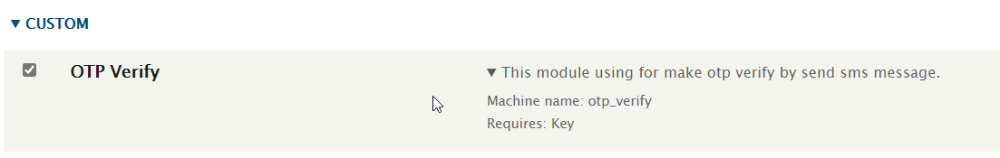
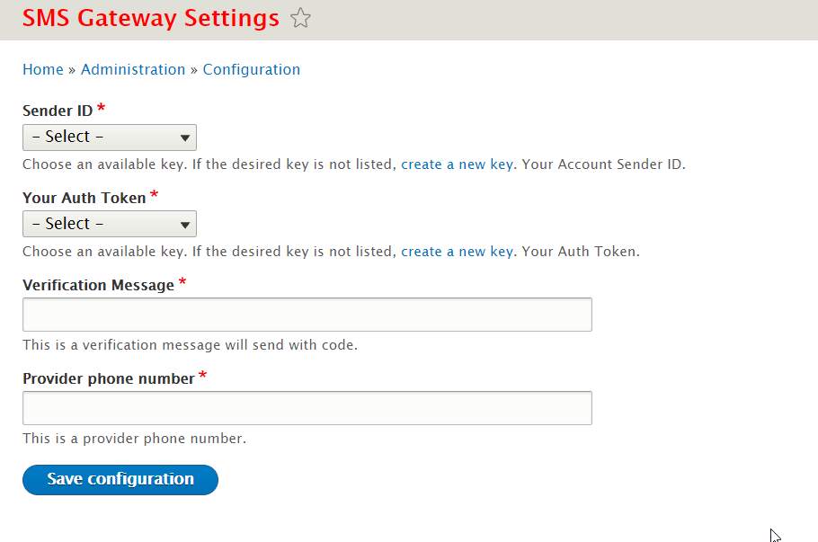

# OTP VERIFICATION

## Drupal custom module for make otp verification using sms `Twilio` gateway.

## Installation

- download module files and set folder in path `web\modules\custom`.
- go to your project root and add to `composer.json` with code.

```php
    "repositories": [
    {
        "type": "path",
        "url": "web/modules/custom/otp_verify"
    }
],
```

- run this command to download dependencies.

```bash
composer require drupal/otp_verify
```

- go to enable module.



- go to config for create new key `admin/config/system/keys/add`
  - Twilio Account SID
  - Twilio Auth Token
- go to config path `admin/config/otp_verify` to set sms configuration



## Using

### When user make register will be blocked and will recive sms message contains otp verification code and redirect to otp form

### for enter otp code to verify his account.

```php
/**
 * @file
 * Contains otp_verify module.
 */

use Drupal\Core\Url;
use Symfony\Component\HttpFoundation\RedirectResponse;
use Drupal\Core\Entity\EntityInterface;

/**
 * Implements hook_entity_insert().
 */
function otp_verify_entity_insert(EntityInterface $entity) {
  $verification_code_service = \Drupal::service('otp_verify.verification_code');
  $otp_verify_service = \Drupal::service('otp_verify.gateway');
  if ($entity->getEntityTypeId() === 'user' && !$verification_code_service->isVerified($entity->id())) {
    $entity->block();
    $transaction = \Drupal::database()->startTransaction();
    try {
      // Generate otp code.
      $code = $verification_code_service->storeCodeInDataBase($entity->id());
      // Get verification message.
      $message = $verification_code_service->getVerificationMessage($code);
      $phone = $entity->field_phone->getString();
      // Send sms message.
      $otp_verify_service->sendSmsMessage($phone, $message);
      // Redirect to verify form.
      $redirect = new RedirectResponse(Url::fromRoute('otp_verify.otp_form')->toString());
      $redirect->send();
    }
    catch (\Exception $ex) {
      $transaction->rollBack();
      \Drupal::messenger()->addError($ex->getMessage());
    }
    unset($transaction);
  }
}
```

_if there is any issue you can make an issue on repo_
